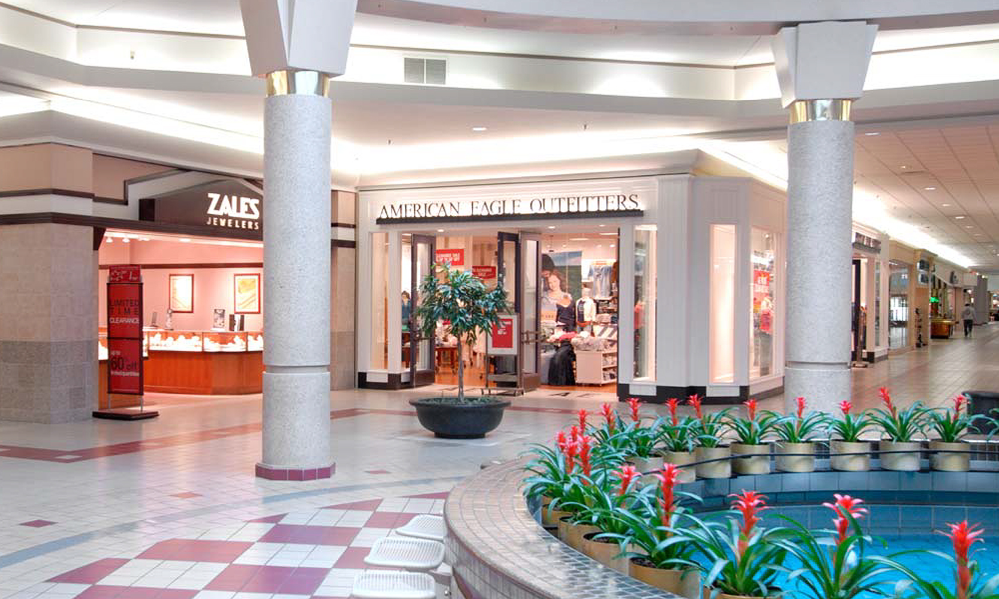

# Mallwalker

A first-person walking sim set in **River Oaks Centre**, Decatur, Alabama, as it
stood in the mid-1990s — rebuilt in voxels.

No shopping, no objectives. You walk the concourse.



**Play it in a browser:** https://claude.ai/code/artifact/90e8f7bd-7193-4152-9ad5-e9d53fae30e8

## Running it

```
npm install
npm run dev      # http://localhost:5173
```

Desktop: WASD to walk, mouse to look, Shift to power walk, Space to hop, Esc to
release the cursor. Phones and tablets get an on-screen stick (left thumb),
a look pad (right thumb), and RUN / HOP buttons — the mode is picked
automatically from `pointer: coarse`.

## What's modelled

Geometry is traced from the mall's own fold-out directory, scanned in
`public/reference/directory-1990s.jpg`. Every numbered space on that map exists
in the world at its real address, with the tenant the directory lists in it:

| | |
|---|---|
| **100** | Sears |
| **200** | Castner Knott — Store for Men & Children |
| **300** | JCPenney |
| **400** | Castner Knott |
| **500** | Parisian |
| **600** | Castner Knott — Store for Home *(outparcel)* |
| **601** | River Oaks Cinema 8 *(outparcel)* |

…plus 52 named inline tenants (Camelot, KayBee, Lane Bryant, Sbarro's, Revco,
Morrison's Cafeteria, the Decatur Public Library branch in 480, and so on),
23 spaces the directory shows as vacant, the eight lettered kiosks, both
restroom blocks and the mall office.

Interior detail — mauve-and-cream diamond tile, coved and lit ceiling soffits,
speckled granite columns, the skylit fountain court with its brass pots of
bromeliads — is drawn from period photography of the centre court.

**Every tenant has its own storefront.** `src/game/tenants.js` gives all 52
named spaces a closure type and a pair of house colours: KayBee's loudest
colour sits right at the lease line with stock stacked in the opening, because
that is exactly why the format existed; Camelot sits behind a dark display
window; Sbarro's has no glazing at all, just a tiled counter; AmSouth is a
solid front with one door and one window; the 23 vacancies are papered over
from inside and gated, with a SPACE AVAILABLE card. There is no logo artwork
anywhere — only the tenant's name, set plain.

Storefront dimensions follow real mall tenant design criteria: the lease line
sits 22″ back from the face of the landlord's neutral pier, and blade signs
project 24″ with their underside 9′-0″ clear.

**Light is baked.** `src/engine/LightGrid.js` treats the lit ceiling soffits,
the court skylight and the shops' own ceilings as emitters and floods that
light through open space on a 1 m grid; meshing samples it per vertex. Solid
cells hold no light, so creases and undersides shade themselves — ambient
occlusion falls out of the same pass. Nothing is lit at runtime.

**Sound is synthesised**, so the whole mall still ships as one file: an HVAC
bed, the fountain when you are near it, muzak leaking out of Camelot, and
footsteps in a room whose reverb opens up as the ceiling does. **M** mutes.

**Interiors are fitted out.** Each unit gets perimeter shelving, floor
fixtures suited to its trade — gondola runs in the discount stores, round racks
and mannequins in apparel, a kitchen line in the food units, a desk and chairs
in the service offices, chairs and mirrors in the salons — and a lay-in
acoustic ceiling with fluorescent troffers that feeds the light bake, so shops
glow through their own glass.

**The anchors are merchandised.** `src/game/anchors.js` divides each of the
five department stores into departments in normalised coordinates, laid out the
way a 1990s department store actually planned a floor: cosmetics and fine
jewellery on hard floor right inside the mall doors, soft goods on carpet
behind them, hard lines and the home store furthest from the entrance. Sears
keeps its own character — Appliances, Craftsman and Automotive along the back
wall. The gaps between departments become the aisles, so nobody has to draw an
aisle, and each department gets its own floor finish, its own fixtures (round
racks and four-ways, glass cosmetics counters with lit back units, gondola
runs, shoe benches, tall Craftsman gondolas, sofa groups) and a hanging sign on
rods.

The concourse follows the photographs in `public/reference/`: plain tile with a
band hugging the shopfronts and the maroon runner with lighter dashes down the
centre, tall coved and skylit ceilings over the main run, low acoustic tile
with troffers in the wings, glass-case kiosks, coin-op kiddie rides on a black
mat, banner stands and A-frame sale signs.

The you-are-here directories are drawn from the same plan data the world is
built from, so the map can never disagree with the building around it.

Add `?season=christmas` (or `backToSchool`) to swap the temporary tenants the
directory lists — Dippin' Dots, Railroad Bazaar, Silver Tree, Snows Gifts.

### Where the model departs from the map

The printed directory draws corridors far narrower than a person can walk, and
compresses the anchors. Corridors are therefore widened to real dimensions
(15.4 m main concourse, ~12.8 m on the wings) and the flanking bays pushed back.
Relative position, adjacency and unit numbering all follow the directory.
Scale is fixed at **0.32 m per scan pixel**, which puts the mall at roughly
250 m end to end.

## How it's built

```
src/engine/    voxel storage, greedy mesher, palette, metre-space drawing
src/game/      the plan (data), the builder, player, touch controls
tools/shoot.mjs  headless screenshotter for checking the build
```

The world is a sparse 25 cm voxel grid. The mall is built **subtractively**:
every envelope block and anchor is filled as one solid mass, then corridors,
shops and anchor boxes are carved back out. Nothing the player can reach was
left to chance, and the building can't leak.

That grid is then greedy-meshed — runs of identical faces collapse into single
quads, taking the mall from ~1M coplanar floor quads to about 76k triangles
total, merged into 3×3-chunk sectors for frustum culling. Face shading is baked
into vertex colours, so it renders unlit and runs on a phone.

`src/game/plan.js` is the only file you need to touch to change the layout.
Rectangles are given in scan-pixel coordinates so they can be checked against
the map by eye.

### Packaging

`node tools/build-artifact.mjs` folds `dist/` into a single self-contained
`artifact/mallwalker.html` (~485 KB) with the bundle and stylesheet inlined —
nothing is fetched at runtime but the webfont, which has a real fallback stack.

### Checking the shell

```
node tools/leaktest.mjs
```

Floods air inward from outside the building and reports anywhere it reaches
interior space. Run it after any change to `plan.js` — a corridor extended to
the edge of its envelope block carves away its own end wall, and the hole is
invisible until you walk into it.

### Checking a change

```
npm run build
npx vite preview --port 4173 &
node tools/shoot.mjs ./shots '[["court", 96, 158, 4.2, -0.05]]'
```

Each viewpoint is `[name, x, z, yaw, pitch]` in world metres.

## Not there yet

- **NPCs.** The point of the whole thing: other walkers to pass and talk to.
  Nothing is stubbed for them yet.
- The exterior is a brick skin and a flat parking lot — no cars, no entrances
  from outside, no landscaping.
- The seasonal system only swaps carts. Centre-court decoration and window
  sale signage don't change yet.
- 360k triangles. Fine on a desktop, and it holds up on a phone, but the
  fixture density in the anchors is the first thing to trim if it doesn't.
- Bay geometry is eyeballed from the scan to about ±1 m. Worth a second pass
  against the modern floorplan in `public/reference/floorplan-modern.jpg`,
  which covers the same building with cleaner outlines.
